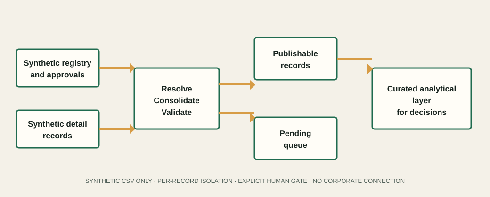

# Kaizen Analytics Pipeline

> Conceptual, sanitized case study about improvement-initiative governance, validation and decision support. It is not a copy of an employer pipeline, dashboard or workbook.

**Business focus:** Continuous improvement · Portfolio visibility · Data governance · Decision support  
**Methods and tools:** Python · Power Query/Power BI concepts · Data validation · Kaizen · PDCA

## Executive summary

Continuous-improvement initiatives become difficult to follow when project information, owners, stages and evidence are distributed across files and routines. Leaders need a trustworthy view of status, missing information and priorities.

This repository demonstrates a transparent public method for consolidating synthetic improvement records, applying validation rules, isolating pending items and producing a curated analytical layer. It deliberately excludes original workbooks, reports, dashboards, governance documents and corporate connectors.

## Business challenge

- Distributed records create inconsistent definitions and follow-up.
- A missing or malformed source should not stop the entire portfolio update.
- Technical validity is different from business approval.
- Dashboards cannot be trusted without ownership and validation upstream.

## My contribution

The case reflects work on consolidation, validation and monitoring of improvement data, with the goal of making routines more visible and supporting decisions. The public implementation rebuilds the method with fictional records and a simplified local data contract.

## Conceptual solution

1. Read a synthetic central registry and individual demonstration records.
2. Resolve each expected source using deterministic local/fallback precedence.
3. Validate required fields, identifiers and dates per record.
4. Keep invalid or incomplete records in an explicit pending state.
5. Apply a separate human/business validation gate.
6. Export a curated layer for analytical storytelling.



See the [architecture notes](docs/architecture.md), [data dictionary](docs/data-dictionary.md) and [technical decisions](docs/technical-decisions.md).

## Business value

The approach makes portfolio status easier to review, surfaces incomplete records and creates a common basis for follow-up. Counts printed by the demo describe only its deterministic fixtures and are not business results.

## Safe public demonstration

```bash
python -m venv .venv
python -m pip install -e .
python -m kaizen_pipeline.cli --show-summary
```

The code reads only invented CSV fixtures and writes ignored local outputs. It has no corporate or external connection.

## Repository map

```text
src/kaizen_pipeline/  local consolidation, validation and export logic
tests/                pure-rule tests
sample-data/          fictional projects, people, categories and dates
power-bi/             safe semantic-layer documentation; no PBIX/PBIT
docs/                 conceptual architecture, dictionary and decisions
site/                  static case-study page built from synthetic content
```

## Security and limitations

- No original spreadsheet, report, dashboard, PBIX/PBIT, screenshot or governance document.
- No employee/client data, internal classification, endpoint, path, URL or server name.
- No corporate connector, executable, credential, cookie or browser state.
- The public CSV contract intentionally does not reproduce private workbook structures.
- Business validation is a synthetic input, not an automated claim of approval.

Read [SECURITY.md](SECURITY.md) and [PUBLIC_RELEASE_AUDIT.md](PUBLIC_RELEASE_AUDIT.md) before reuse.

## What I learned

The usefulness of a dashboard starts upstream. Shared definitions, reliable validation and clear ownership are needed before visualization can support decisions.

---

# Português

## Pipeline Analítico de Kaizens

> Estudo de caso conceitual e sanitizado sobre governança de iniciativas de melhoria, validação e apoio à decisão. Não é uma cópia de pipeline, dashboard ou planilha corporativa.

## Resumo executivo

Iniciativas de melhoria contínua ficam difíceis de acompanhar quando informações de projeto, responsáveis, etapas e evidências estão distribuídas entre arquivos e rotinas. Lideranças precisam de uma visão confiável de status, pendências e prioridades.

Este repositório demonstra um método público e transparente para consolidar registros sintéticos de melhoria, aplicar regras de validação, isolar pendências e produzir uma camada analítica curada. Planilhas, relatórios, dashboards, documentos de governança e conectores corporativos originais são excluídos deliberadamente.

## Desafio de negócio

- Registros distribuídos criam definições e acompanhamentos inconsistentes.
- Uma fonte ausente ou inválida não deve interromper toda a atualização do portfólio.
- Validade técnica é diferente de aprovação do negócio.
- Dashboards não são confiáveis sem responsabilidade e validação antes da visualização.

## Minha contribuição

O estudo reflete atuação em consolidação, validação e acompanhamento de dados de melhoria, buscando dar visibilidade às rotinas e apoiar decisões. A implementação pública reconstrói o método com registros fictícios e um contrato de dados local simplificado.

## Solução conceitual

1. Ler um registro central sintético e arquivos individuais de demonstração.
2. Resolver cada fonte esperada por precedência local/fallback determinística.
3. Validar campos obrigatórios, identificadores e datas por registro.
4. Manter registros inválidos ou incompletos em um estado explícito de pendência.
5. Aplicar uma etapa separada de validação humana/do negócio.
6. Exportar uma camada curada para narrativa analítica.

## Valor de negócio

A abordagem facilita a revisão do portfólio, evidencia registros incompletos e cria uma base comum para acompanhamento. As contagens exibidas pela demonstração descrevem somente dados fictícios determinísticos e não representam resultados de negócio.

## Segurança e limitações

Não há planilha, relatório, dashboard, PBIX/PBIT, screenshot ou documento de governança original; dados de funcionários ou clientes; classificação interna; endpoint, caminho, URL ou servidor; conector corporativo; executável; credencial; cookie ou estado de navegador. O contrato CSV público é simplificado e a validação de negócio é uma entrada sintética.

## Aprendizado

A utilidade de um dashboard começa antes da visualização. Definições compartilhadas, validação confiável e responsabilidade clara pelo dado são necessárias para apoiar decisões.

